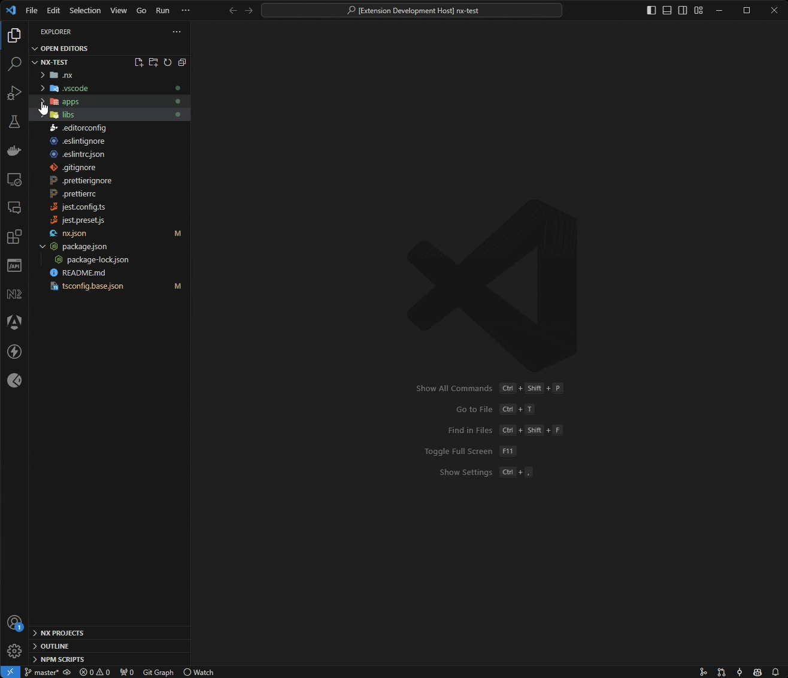

Easily hide NX projects from your workspace during development.

If you have a lot of NX projects in your NX repository, you can hide unnecessary ones and continue working with the remaining ones. The extension exclude projects from the file explorer and from search.

[VS Code Marketplace](https://marketplace.visualstudio.com/items?itemName=kvart714.nx-filter)
